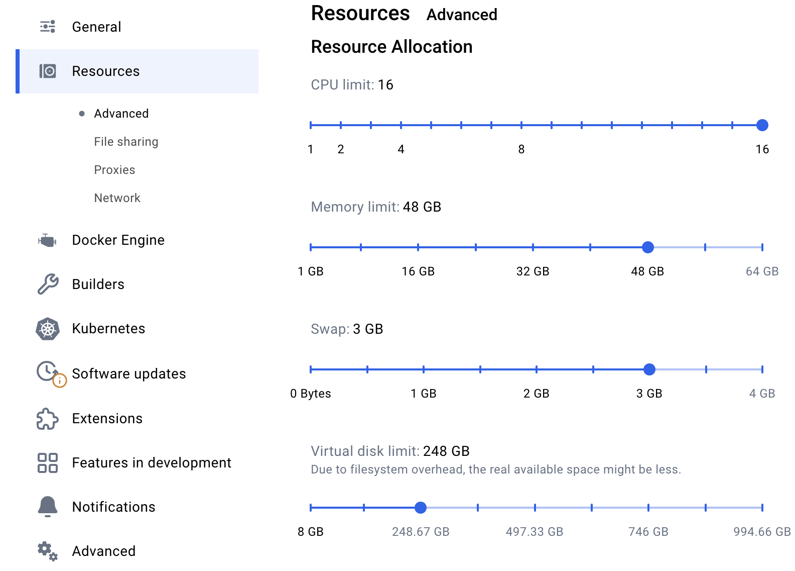

# Data platform WS

## Prerequisites

1. Mac with OS X 14.7 (update OS X to 14.7 if you have an older version)
1. Docker with Docker Compose capability (i.e. [Colima](https://github.com/abiosoft/colima), [OrbStack](https://orbstack.dev/), [PodMan](https://podman.io/), [Docker Desktop](https://www.docker.com/products/docker-desktop/))
1. Enough CPU, Memory and Disk resources dedicated to Docker. We will be using a lot in the installation and running process

## Getting started

1. Unlock `sudo` in Privileges app
1. `git clone https://github.com/mahic/platform-ws.git`
1. `./scripts/install.sh`
1. `docker compose up`

If everything is installed correctly, you should be able to 
`curl https://platform.local:9999` and get result `Hello platform.local!`

# Tasks

* [Task1](/tasks/task1.md) - setting up some security